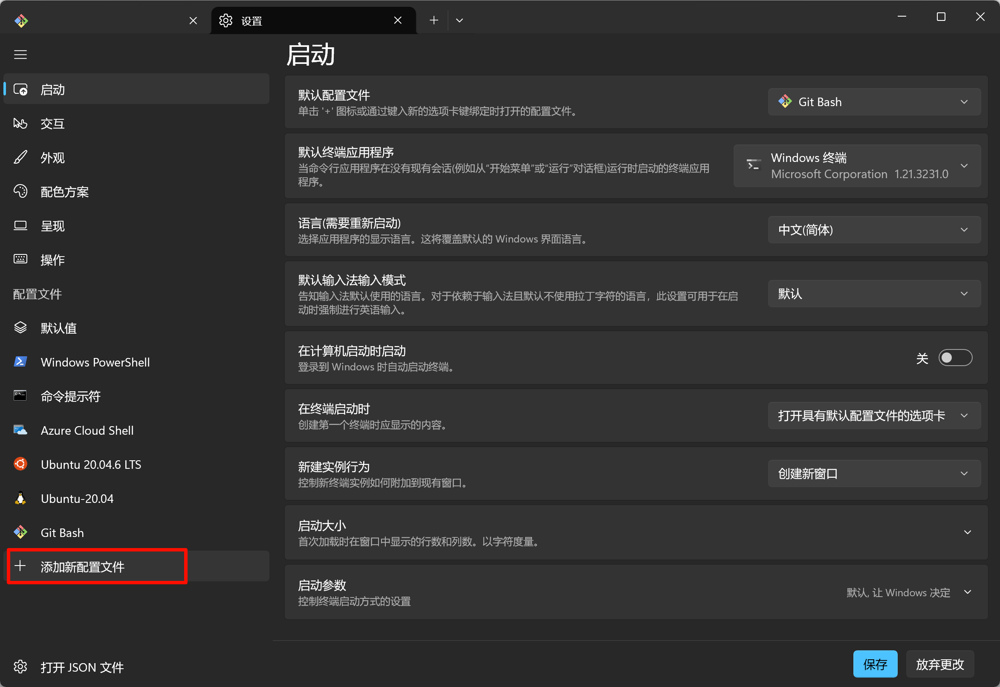
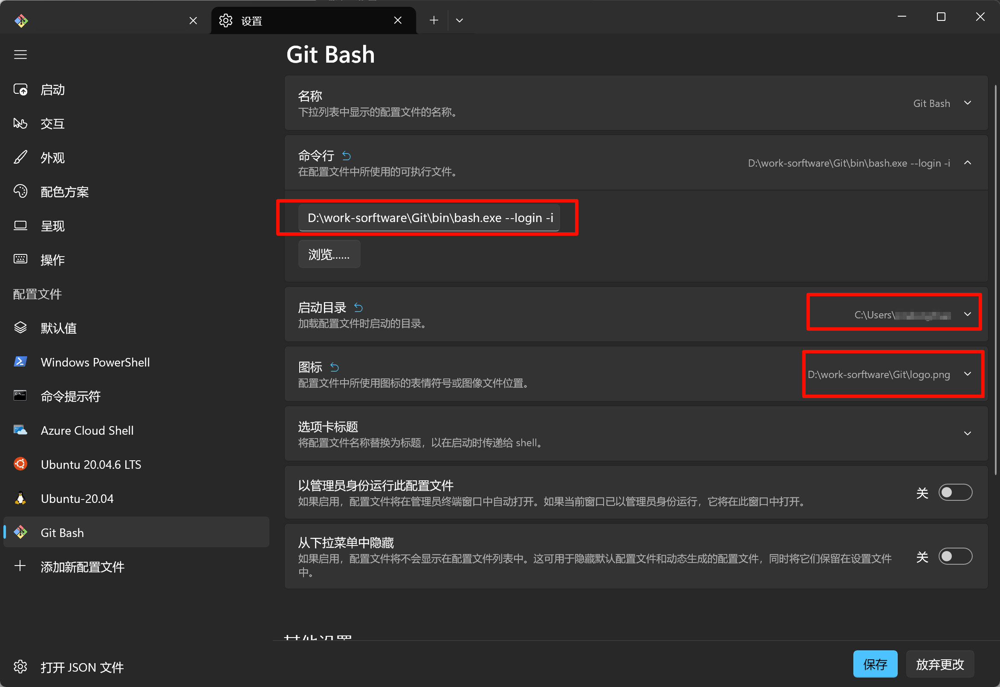
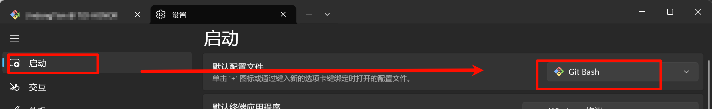
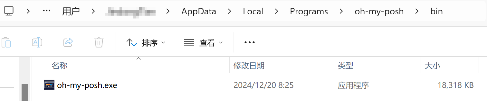
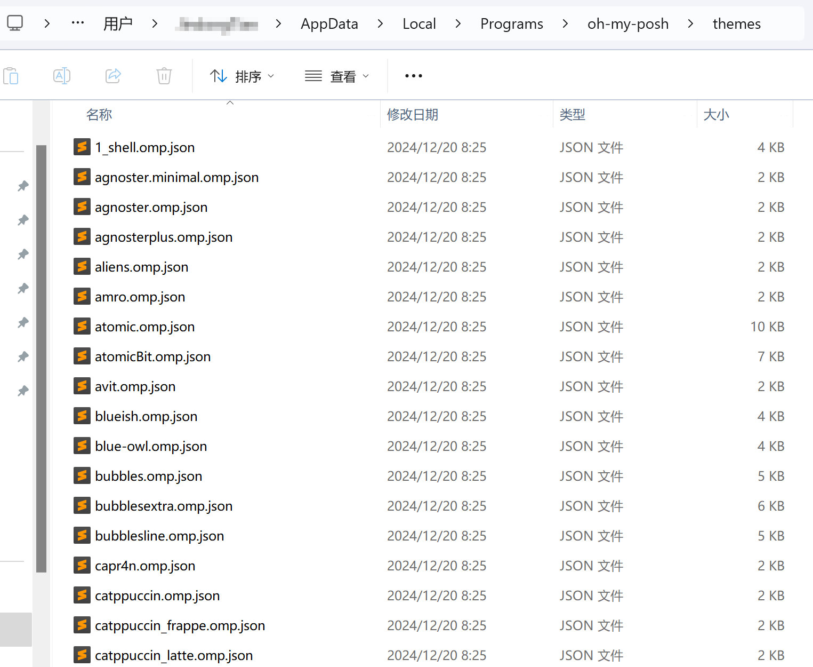

# Git Bash美化教程

## 一. Windows Terminal 新增 Git Bash

新增 Git Bash配置文件：



配置 Git Bash 启动路径：



配置 Windows Terminal 默认启动 Git Bash：



## 二. 美化Git Bash

第一步：安装 oh-my-posh

执行如下命令：

```shell
winget install JanDeDobbeleer.OhMyPosh
```

安装好后在家目录下，可以看到oh-my-posh：



第二步：配置环境变量

将刚安装路径 `C:\Users\{user}\AppData\Local\Programs\oh-my-posh\bin` 添加到 PATH

第三步：更换主题

进入 oh-my-posh 安装目录下，有一个themes文件夹，里面存放着不同主题的配置文件：



我们可以在官网挑选自己喜欢的配色主题，然后在文件夹中搜索对应配色文件名，然后编辑`~/profile` 文件（没有则创建）：

```shell
eval "$(oh-my-posh --init --shell bash --config ~/AppData/Local/Programs/oh-my-posh/themes/jblab_2021.omp.json)"
```

我使用的是 `jblab_2021` 主题：

[主题预览](https://ohmyposh.dev/docs/themes)


