# Windows 系统使用 ZSH 美化 Git Bash

此前，我们讲解了一种借助 Windows Subsystem for Linux（WSL）让用户在 Windows 操作系统中运用 Linux Shell 命令，进而高效地实现文件访问、编译等开发工作。

[Windows系统命令行的最佳实践 | 听到微笑的博客](https://blog.bigcoder.cn/article/e74aca57.html)

这种借助 Windows Subsystem for Linux（WSL）的方式，其显著优势在于提供了完整的 Linux 子系统环境，这意味着在常规 Linux 系统中所使用的各类命令，在 WSL 中均可无障碍执行，极大地拓展了 Windows 用户对于 Linux 工具和命令的使用场景。

然而，WSL 是在 Windows 内核之上搭建的轻量级 Linux 兼容层，从某种程度上可以类比为一个能够访问宿主文件的虚拟机。这种架构也引发了一些性能问题。在文件访问性能上，WSL 子系统对 Windows 宿主文件的访问效率偏低，这在处理大量文件的编译打包场景可能会产生明显的延迟。

此外，在环境配置的兼容性上也存在局限。例如，当在 Windows 宿主系统中安装并配置好 Java JDK 后，WSL 子系统并不能直接调用宿主机环境的 `java` 可执行程序。若要在 WSL 中使用 JDK，仍然需要在 WSL 内部另行安装对应 Linux 版本的 JDK，这无疑增加了大家配置环境的成本。

在 Windows 环境下，Windows Git 自带的 Git Bash 发挥着重要作用。它并非 Linux 虚拟机，而是模拟类 Unix 环境的命令行工具，为 Windows 用户提供了类似 Linux 的命令行操作体验，有效避免了像 WSL 那样存在的文件访问性能不佳以及环境配置兼容性问题。但遗憾的是，Git Bash 的默认客户端界面不太美观。作为一个注重使用体验的开发者，我一直想对 Git Bash 进行美化，使其能达到类似 Mac ZSH 的视觉效果。

在我一通折腾下，Windows Git Bash 重新焕发新春：

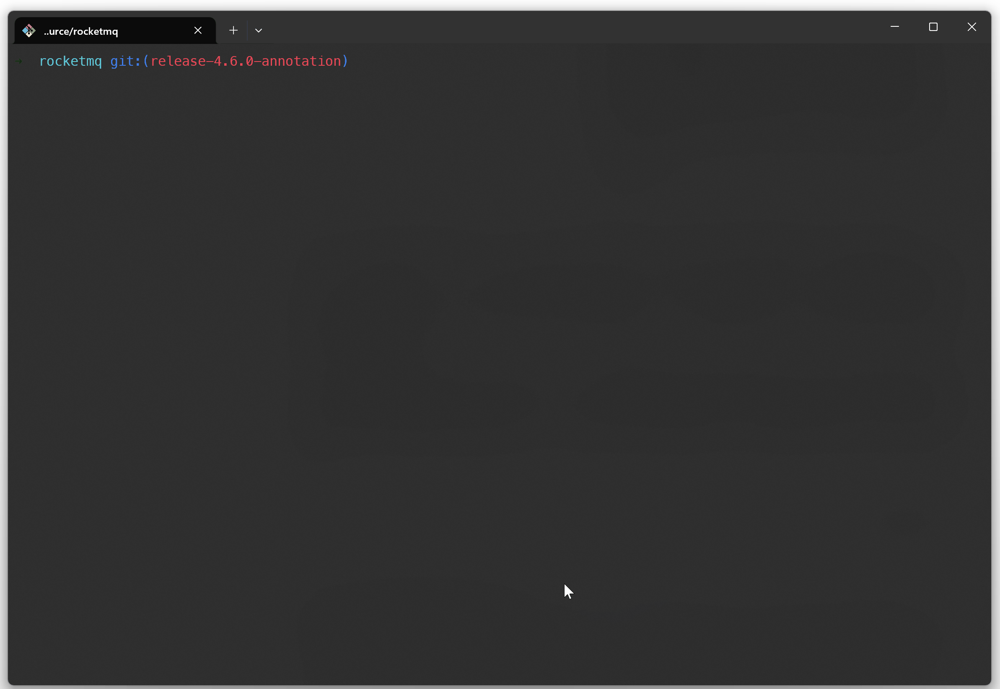

配置完后的 Git Bash，拥有类似 Mac 终端的体验：

- 类Unix命令行

- 显示当前文件夹所在的Git分支
- 命令提示

现在我们来介绍一下整体的安装配置步骤：

## 一. 安装配置步骤

### 第一步：安装Git

[Git - Downloading Package](https://git-scm.com/downloads/win)

安装时请记住 Git 的安装目录：

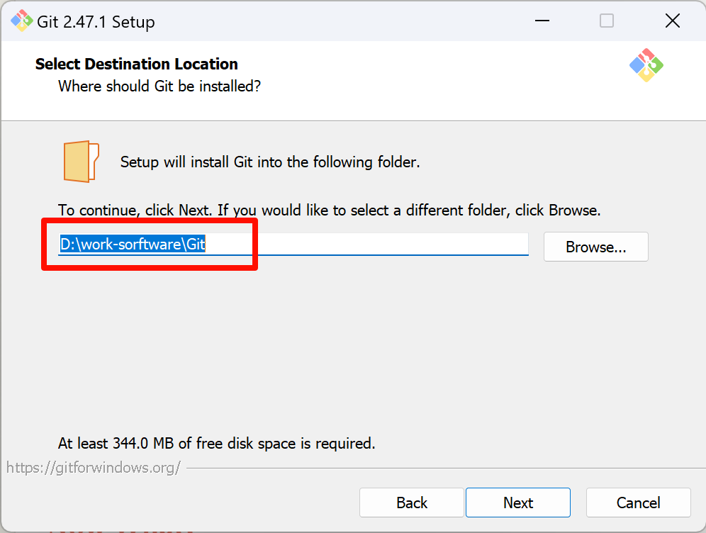

并且安装时请勾选 Git Bash 选项：

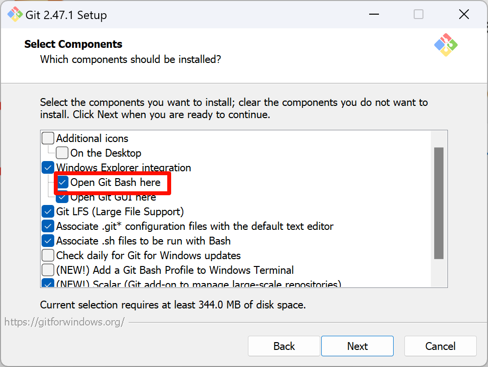

后面一直下一步，直至安装成功即可，默认情况下Git Bash的终端是这样的：

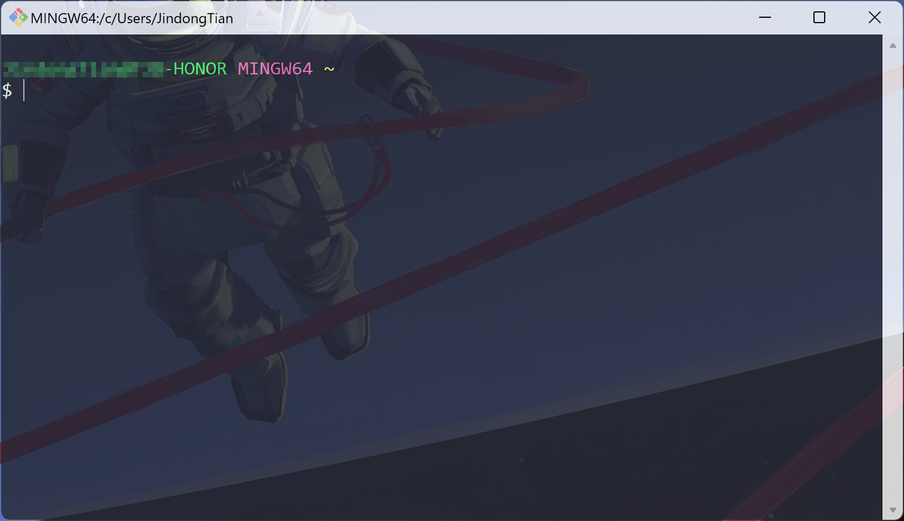

### 第二步：下载并配置ZSH

通过下面的链接下载  [Zsh for Windows package](https://packages.msys2.org/package/zsh?repo=msys&variant=x86_64) 软件包。

下载地址：[zsh-5.9-2-x86_64](https://mirror.msys2.org/msys/x86_64/zsh-5.9-2-x86_64.pkg.tar.zst)

下载完成后得到以下文件：

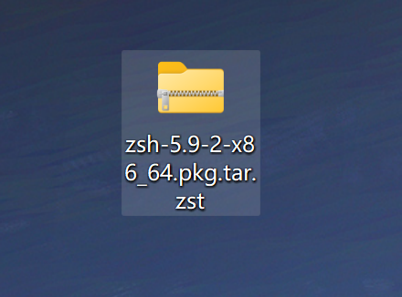

解压该文件，可以得到比较关键的 `etc` 和 `usr` 目录，里面包含 zsh 可执行文件：

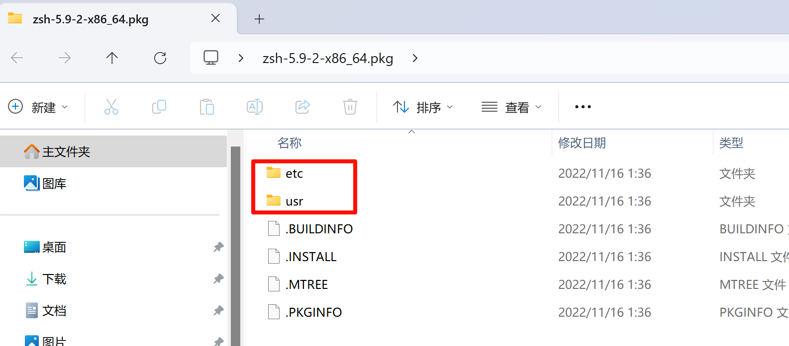

我们需要 `etc` 和 `usr` 目录，因此将这两个目录从解压的文件夹复制到 Git 安装目录中，出现提示时，选择覆盖所有现有文件的选项，不用担心，这两个目录（`etc`和`usr`）包含全新文件，不会覆盖现有文件。以我们前面的安装教程为例，需要将这两个目录文件复制到 `D:\work-sorftware\Git` 下。

使用文本编辑工具打开 `{GIT_DIR}/Git/etc/profile` 文件，`{GIT_DIR}`代表Git安装目录。注释掉文件底部附近以 line 开头的整个块 `if [ ! "x${BASH_VERSION}" = "x" ]; then` 并以`fi`行结束。在撰写本文时，我注释掉了`111-133`行。我们不需要所有这些代码，因为我们知道我们将使用 ZSH。并在注释掉的块下方，添加以下 3 行：

```shell
HOSTNAME="$(exec /usr/bin/hostname)"
profile_d zsh
SHELL='/usr/bin/zsh'
```

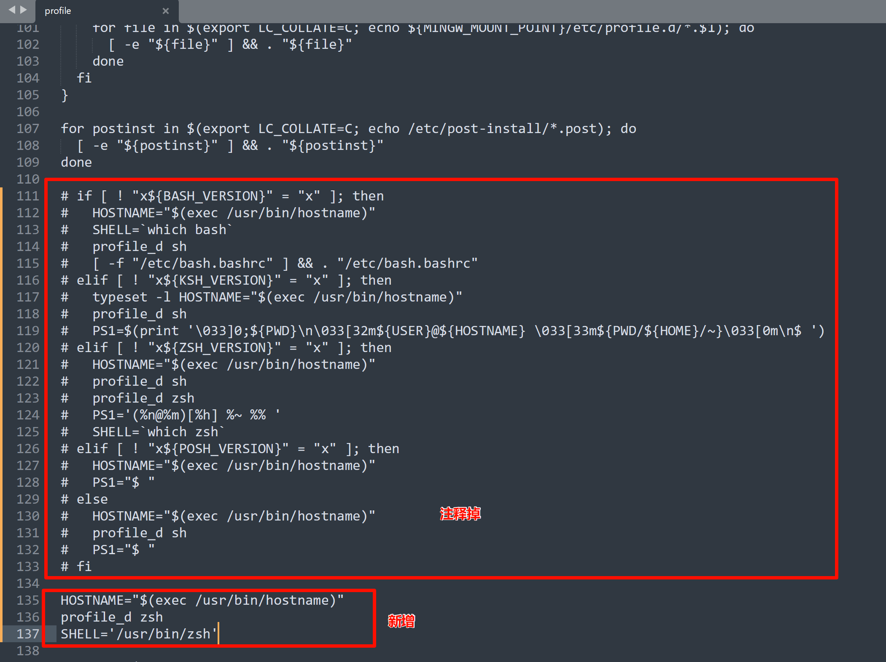

### 第三步：下载并配置 Windows Terminal

前往微软官方商店下载 Windows Terminal:


打开Windows Terminal，新增配置文件，在命令行中填写 zsh 启动命令：

```shell
{GIT_DIR}\usr\bin\zsh.exe -il
```

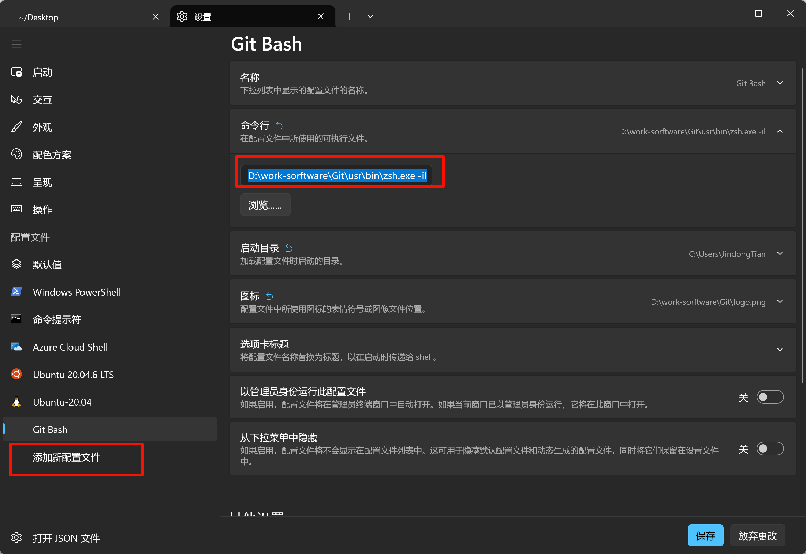

上面的配置文件使用自定义图标，因此您可以参考下面的默认`git-for-windows.ico`图标文件 `D:\work-sorftware\Git\mingw64\share\git` 或者再找一个你喜欢的。

也可以在启动配置中将 Git Bash 设置为默认 Windows 终端配置文件。

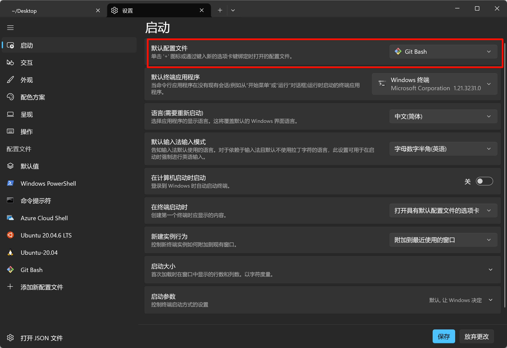

### 第四步：安装 oh-my-zsh

从任意位置执行以下命令，将[Oh My Zsh](https://ohmyz.sh/)安装在`$HOME/.oh-my-zsh`目录下：

```shell
wget https://raw.githubusercontent.com/ohmyzsh/ohmyzsh/master/tools/install.sh
sh install.sh
```

使用以下命令克隆`zsh-autosuggestions` ：

```shell
git clone https://github.com/zsh-users/zsh-autosuggestions.git $ZSH_CUSTOM/plugins/zsh-autosuggestions
```

打开`~/.zshrc`文件，将`zsh-autosuggestions`插件添加到`oh-my-zsh`插件：


执行下列命令重新加载配置文件：

```shell
source ~/.zshrc
```

我们就可以看到 `zsh-autosuggestions` 生效了：


## 二. IDEA使用 Git Bash

按照上述步骤配置好 Git Bash 后，我们可以在诸如IDEA等开发工具中配置使用ZSH：

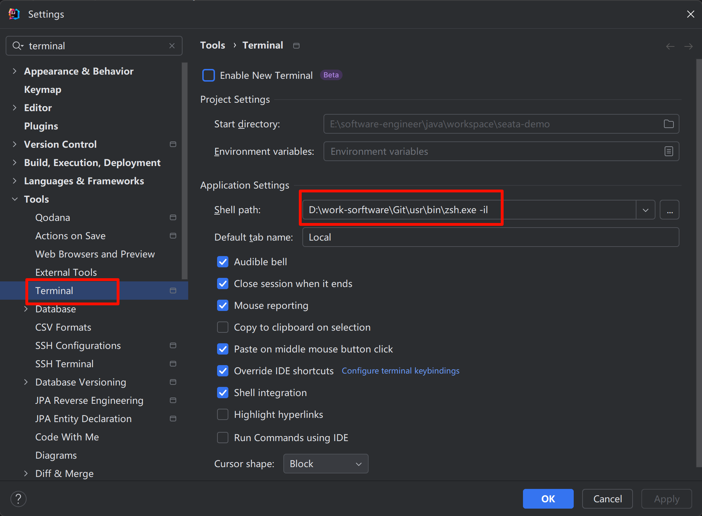

这样IDEA命令行，也就可以使用ZSH了：

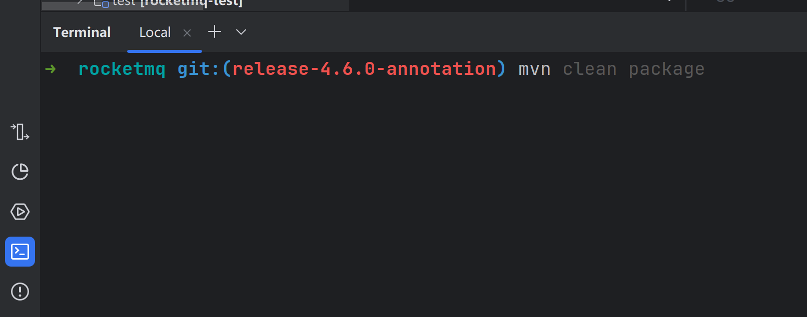

## 二. 总结

本文介绍了在 Windows 系统中使用 ZSH 美化 Git Bash 的方法，对比了 WSL 的优缺点后，详细阐述了 Git Bash 美化步骤。包括安装 Git 并勾选相关选项，下载并配置 ZSH，安装并设置 Windows Terminal，以及安装 `oh-my-zsh` 和 `zsh-autosuggestions` 插件并进行相应配置。最终使 Git Bash 拥有类似 Mac 终端的体验，提升 Windows 用户的命令行操作体验和效率。

> 本文参考至：[Using Zsh and zsh-autosuggestions on Windows Terminal with Oh My Posh theme - DEV Community](https://dev.to/goranvasic/using-zsh-and-zsh-autosuggestions-on-windows-terminal-with-oh-my-posh-theme-do6)