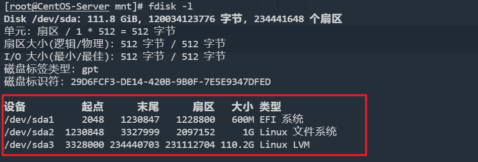
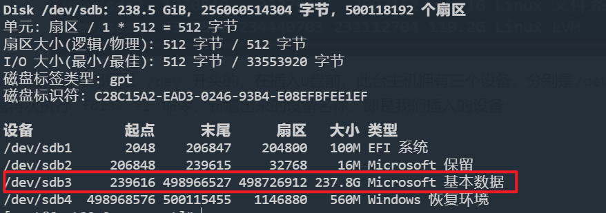
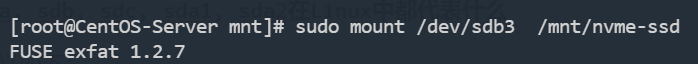

# 挂载磁盘

在 Linux 系统中，与 Windows 不一样的是，无法自动识别加载外部设备例如 U 盘、硬盘，我们如果需要访问外置磁盘的文件，需要先进行挂载操作。

## 一. 挂载磁盘

### 第一步：确定插入设备的设备名称

在插入外置磁盘之前，我们需要查看电脑中现存的存储设备有哪些：

```shell
sudo fdisk -l
```



Linux中设备名称都是以 `/dev` 开头的，在插入U盘前，此台主机拥有一个设备（/dev/sda），这个设备又有三个分区，分别是`/dev/sda1`、`/dev/sda2`、`/dev/sda3`。

此时我们插入U盘再次执行 `fdisk -l` 命令，新增出来的设备名称，即是我们插入的设备：



插入新的U盘后，即可发现多出来了`/dev/sdb`，该设备下有四个分区，我们确定需要挂载的分区设备名称为 `/dev/sdb3`。

> **sda, sdb, sdc, sda1, sda2在Linux中都代表什么**
>
> 意义如下：
>
> - 第一个软驱 `/dev/fd0`.
> - 第二个软驱 `/dev/fd1`.
> - 第一块硬盘 `/dev/sda`.
> - 第二块硬盘 `/dev/sdb`, 以此类推.
> - 第一个SCSI CD-ROM `/dev/scd0`, 可以用`/dev/sr0`.
>
> sda1, sda2是sda这块硬盘上的两个分区。

### 第二步：创建文件夹

在挂载之前，我们需要创建一个空的文件夹，通常是在 `/mnt` 目录下创建：

```shell
mkdir /mnt/nvme-ssd
```

### 第三步：挂载

命令格式：`mount [options] 设备名称 挂载的目录`

```shell
sudo mount /dev/sdb3  /mnt/nvme-ssd
```



这样U盘就成功挂载到 `/mnt/nvme-ssd` 目录上了，我们进入挂载目录 `/mnt/nvme-ssd` 就相当于进入了U盘中了，可以对U盘中的文件进行任意操作。

在挂载 `exFat` 格式的U盘时，可能会出现挂载失败的问题，是因为 `exFat` 是Windows平台的文件系统，Linux需要额外安装软件包才能访问该文件系统：

参考：[如何在CentOS 7上挂载exFAT驱动器 | myfreax](https://www.myfreax.com/how-to-mount-an-exfat-drive-on-centos-7/)

## 二. 取消挂载

下面两条命令分别通过设备名和挂载点卸载文件系统，同时输出详细信息：

通过设备名卸载

```shell
umount -v /dev/sdb3
/dev/sdb3 umounted
```

通过挂载点卸载

```shell
umount -v /mnt/nvme-ssd
/tmp/diskboot.img umounted
```

如果设备正忙，卸载即告失败。卸载失败的常见原因是，某个打开的shell当前目录为挂载点里的某个目录：

```shell
umount -v /mnt/mymount/
umount: /mnt/mymount: device is busy
umount: /mnt/mymount: device is busy
```

有时，导致设备忙的原因并不好找。碰到这种情况时，可以用lsof列出已打开文件，然后搜索列表查找待卸载的挂载点：

```shell
lsof | grep mymount         查找mymount分区里打开的文件
bash   9341  francois  cwd   DIR   8,1   1024    2 /mnt/mymount
```

从上面的输出可知，mymount分区无法卸载的原因在于，francois运行的PID为9341的bash进程。


