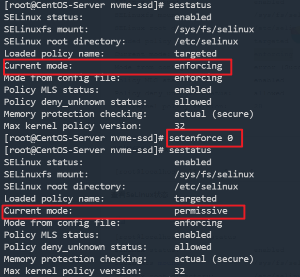
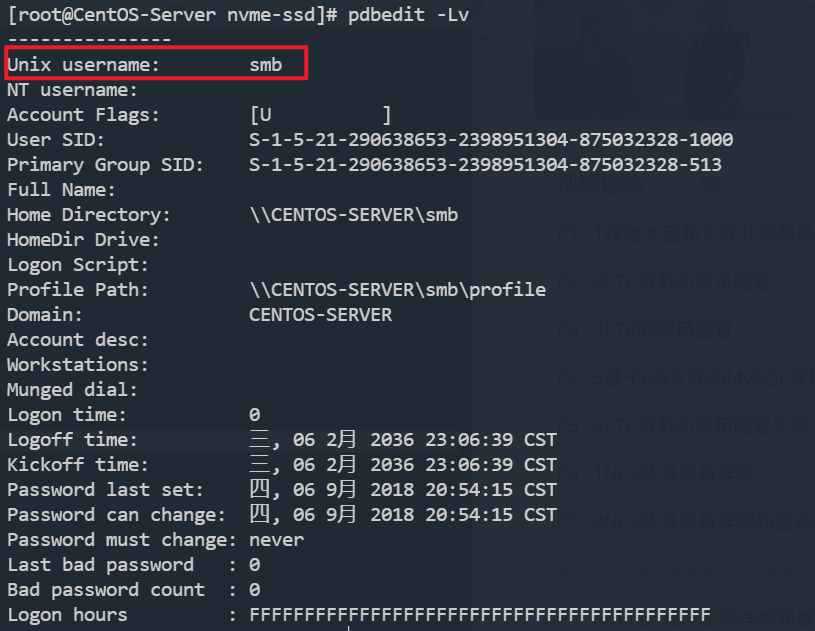
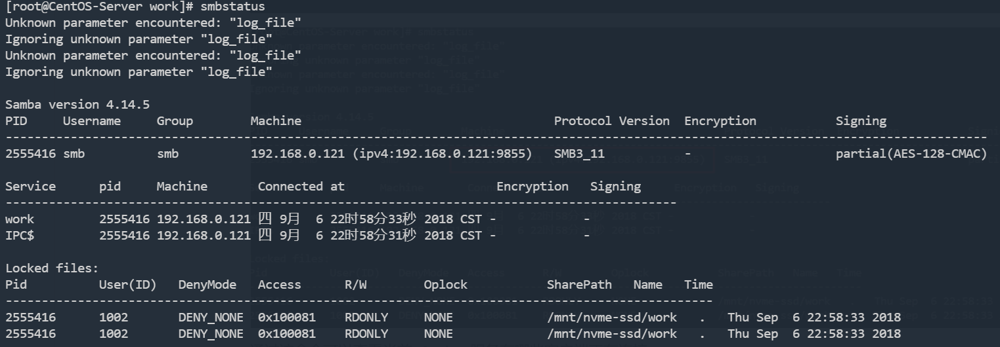

# Samba文件共享服务安装教程

## 一. 介绍

Samba是一个能让Linux系统应用Microsoft网络通讯协议的软件，而SMB是Server Message Block的缩写，即为服务器消息块 ，SMB主要是作为Microsoft的网络通讯协议，后来Samba将SMB通信协议应用到了Linux系统上，就形成了现在的Samba软件。后来微软又把 SMB 改名为 CIFS（Common Internet File System），即公共 Internet 文件系统，并且加入了许多新的功能，这样一来，使得Samba具有了更强大的功能。

Samba最大的功能就是可以用于Linux与windows系统直接的文件共享和打印共享，Samba既可以用于windows与Linux之间的文件共享，也可以用于Linux与Linux之间的资源共享，由于NFS(网络文件系统）可以很好的完成Linux与Linux之间的数据共享，因而 Samba较多的用在了Linux与windows之间的数据共享上面。

SMB是基于客户机/服务器型的协议，因而一台Samba服务器既可以充当文件共享服务器，也可以充当一个Samba的客户端，例如，一台在Linux 下已经架设好的Samba服务器，windows客户端就可以通过SMB协议共享Samba服务器上的资源文件，同时，Samba服务器也可以访问网络中 其它windows系统或者Linux系统共享出来的文件。
Samba在windows下使用的是NetBIOS协议，如果你要使用Linux下共享出来的文件，请确认你的windows系统下是否安装了NetBIOS协议。

组成Samba运行的有两个服务，一个是SMB，另一个是NMB；SMB是Samba 的核心启动服务，主要负责建立 Linux Samba服务器与Samba客户机之间的对话，验证用户身份并提供对文件和打印系统的访问，只有SMB服务启动，才能实现文件的共享，监听139 TCP端口；而NMB服务是负责解析用的，类似与DNS实现的功能，NMB可以把Linux系统共享的工作组名称与其IP对应起来，如果NMB服务没有启动，就只能通过IP来访问共享文件，监听137和138 UDP端口。

例如，某台Samba服务器的IP地址为192.168.126.15，对应的工作组名称为MYWORKGROUP，那么在Windows的IE浏览器输入下面两条指令都可以访问共享文件。其实这就是Windows下查看Linux Samba服务器共享文件的方法。

## 二. 安装 Samba

### 2.1 准备工作

#### 2.1.1 关闭SeLinux

查看SeLinux状态:

```shell
[root@localhost ~]# sestatus
SELinux status:                 enabled
SELinuxfs mount:                /sys/fs/selinux
SELinux root directory:         /etc/selinux
Loaded policy name:             targeted
Current mode:                   enforcing
Mode from config file:          error (Success)
Policy MLS status:              enabled
Policy deny_unknown status:     allowed
Max kernel policy version:      28
```

临时关闭 SeLinux：

```shell
setenforce 0
```

**再次查看SeLinux状态**



> 默认的，SELinux禁止网络上对Samba服务器上的共享目录进行写操作，即使你在smb.conf中允许了这项操作。

**永久关闭SeLinux，需要重启机器**

修改配置文件/etc/selinux/config，将SELINU置为disabled

查看修改后：

```
[root@localhost ~]# cat /etc/selinux/config 

# This file controls the state of SELinux on the system.
# SELINUX= can take one of these three values:
#     enforcing - SELinux security policy is enforced.
#     permissive - SELinux prints warnings instead of enforcing.
#     disabled - No SELinux policy is loaded.
# SELINUX=enforcing
SELINUX=disabled
# SELINUXTYPE= can take one of three two values:
#     targeted - Targeted processes are protected,
#     minimum - Modification of targeted policy. Only selected processes are protected. 
#     mls - Multi Level Security protection.
SELINUXTYPE=targeted 
```

**重启后，查看SeLinux状态**

```
[root@localhost ~]# sestatus
SELinux status:                 disabled
```

#### 2.1.2 开启端口

开启 `445` 端口：

```shell
firewall-cmd --zone=public --add-port=445/tcp --permanent
```

455是samba服务所使用的端口

### 2.2 安装Samba

使用包管理器安装Samba：

```shell
yum install samba -y
```

### 2.3 启动服务

```shell
systemctl start smb
```

设置开机自启：

```shell
systemctl enable smb
```

### 2.4 查看服务运行状态

```shell
systemctl status smb
```

### 2.5 关闭服务

```shell
systemctl stop smb
```

## 三. 管理Samba用户

在配置Samba服务之前，我们需要创建Samba账户，该账户用于在网络终端在连接我们共享服务时使用。

Samba 用户必须是Linux用户，所以我们需要先创建一个Linux用户：

```shell
useradd -s /sbin/nologin smb
```

例如我们创建了一个 `smb` 的Linux用户，由于这个账号只需要给Samba服务使用，所以我们使用了 `/sbin/nologin` 参数，代表该用户不能登录。

### 3.1 添加 Samba 账户

格式：

```shell
smbpasswd -a [用户名]
```

例如：

```shell
smbpasswd -a smb
```

将Linux用户 `smb` 添加进 Samba 中。

### 3.2 修改 Samba 账户密码

```shell
smbpasswd [用户名]
```

### 3.3 删除 Samba 账户

```shell
smbpasswd -x [用户名]
```

### 3.4 查看 Samba 账户

```shell
pdbedit -L -v
```



### 3.5 查看 Samba 服务状态

```shell
smbstatus
```



通过该命令可以查看当前 Samba 服务有哪些客户端正在连接。

## 四. Samba服务配置

配置文件地址：`/etc/samba/smb.conf`

### 4.1 全局配置

在global中添加如下配置：

```yml
log file = /var/log/samba/samba.log.%I # 日志文件路径，%I代表为每一个客户端连接，以IP结尾创建一个独立的日志文件
log level = 2
max log size = 10240 #日志最大大小，单位KB，当达到最大值时，会创建新的日志文件
```

除了上述配置，我们还能通过下列属性，个性化配置Samba服务：

- `hosts allow`：表示允许连接到Samba Server的客户端，多个参数以空格隔开。可以用一个IP表示，也可以用一个网段表示。hosts deny 与hosts allow 刚好相反，例如：``

  ```yaml
  hosts allow=172.17.2.EXCEPT172.17.2.50 #表示允许来自172.17.2.*的主机连接，但排除172.17.2.50
  hosts allow = 192.168.1. 192.168.10.1 #表示允许192.168.1.*网段和192.168.10.1的主机连接
  hosts allow=172.17.2.0/255.255.0.0 #表示容许来自172.17.2.0/255.255.0.0子网中的所有主机连接
  ```

- `max connections`：指定连接Samba Server的最大连接数目。如果超出连接数目，则新的连接请求将被拒绝。0表示不限制。

- `log file`：设置Samba Server日志文件的存储位置以及日志文件名称。在文件名后加个宏%m（主机名），表示对每台访问Samba Server的机器都单独记录一个日志文件。如果pc1、pc2访问过Samba Server，就会在/var/log/samba目录下留下log.pc1和log.pc2两个日志文件。

- `max log size`：设置Samba Server日志文件的最大容量，单位为kB，0代表不限制。

### 4.2 共享配置

```shell
[work] # 方括号中填写分享的名称
    comment = work # 该共享的描述，可以是任意字符串。
    path = /mmt/work #path用来指定共享目录的路径
    public = no #是否能被匿名账户访问，默认值 no
    read only = no #是否只读
    valid users = smb # 特定Samba用户才能访问该共享，多个用户使用空格分开，如果为空，则代表所有Samba用户都能访问该共享，如果要加入一个组就用“@组名”表示。
    write list = smb # read only = no用于控制所有用户都有读写权限，如果想控制只有指定用户有写权限，即可使用 write list，多个用户之间使用空格隔开
    browsable = no # 是否允许所有用户浏览该共享，默认为yes，no代表隐藏
```

共享配置始终以 `[共享名称]` 作为开头，下面的每一行代表该共享的配置。


> 参考：
>
> [CentOS 7下Samba服务器的安装与配置 - Muscleape - 博客园 (cnblogs.com)](https://www.cnblogs.com/muscleape/p/6385583.html)
>
> https://www.cnblogs.com/lemanlai/p/12267330.html

## 