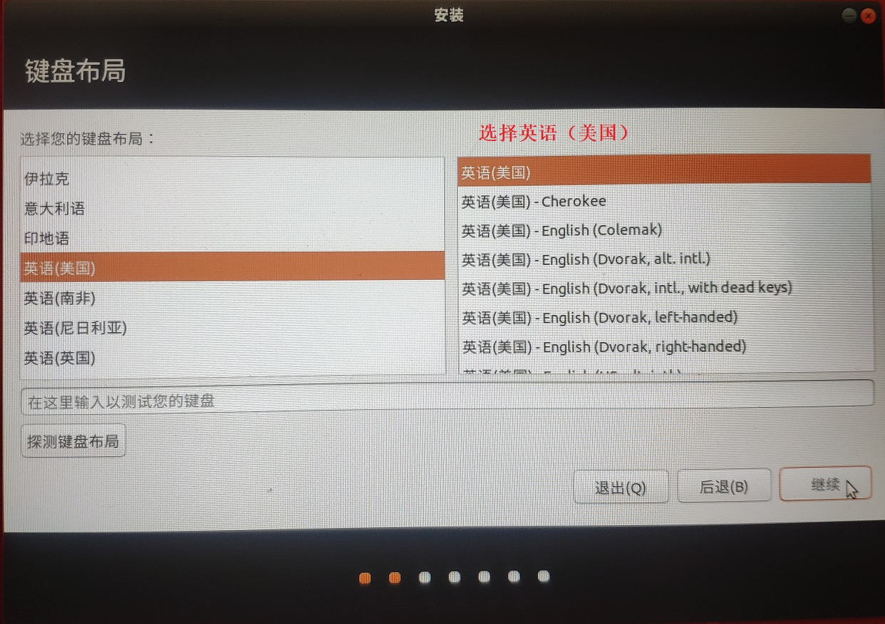
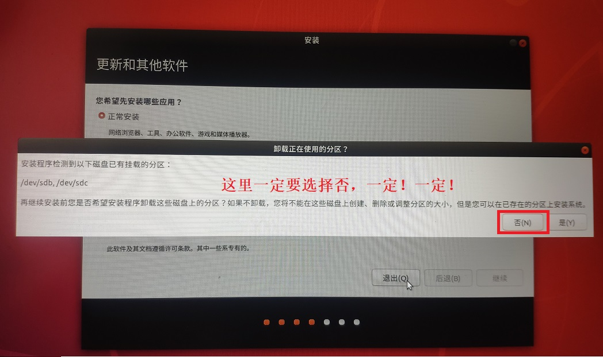
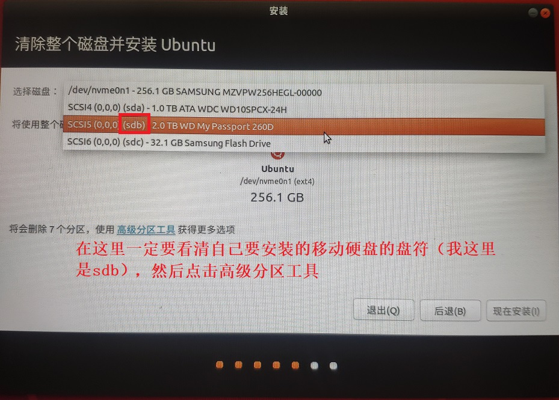
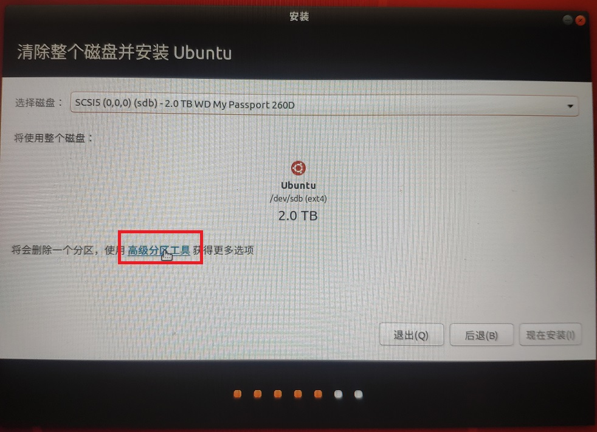
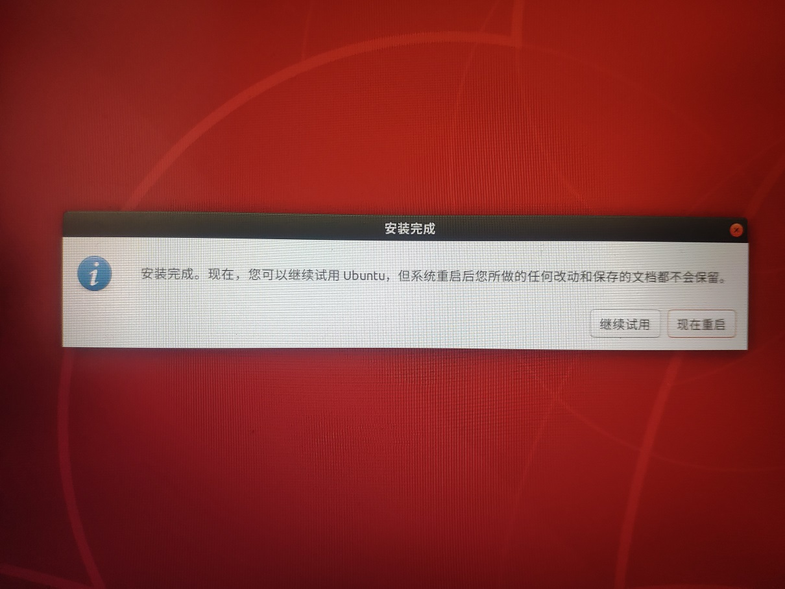
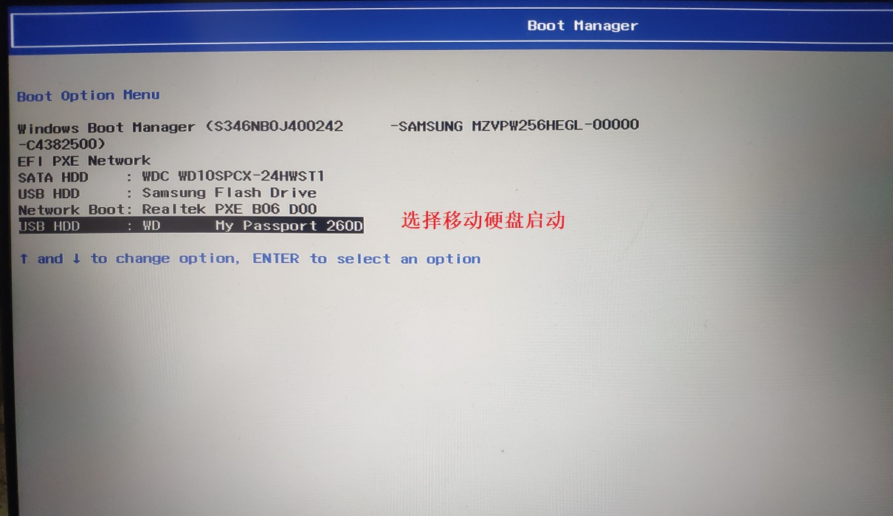
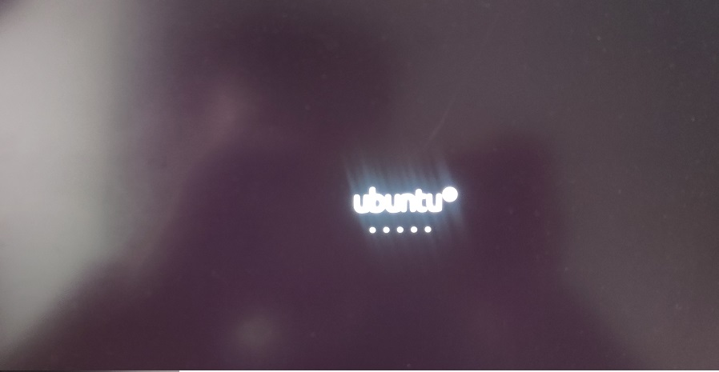

# 安装Ubuntu系统至移动硬盘

**第一步：首先去官网下载iso镜像。**

**第二步：制作一个USB启动盘（U盘容量推荐16G以上），下载（<https://www.pendrivelinux.com/universal-usb-installer-easy-as-1-2-3/>），该软件免安装，按照下图制作启动盘**：

第三步：将移动硬盘分盘，我将原来2T容量的前1T留着安装系统，后面一个分区留着日常保存文件。（此步可略过）

**第四步：将启动U盘和移动硬盘插入电脑、重启电脑。在重启过程中疯狂按（F12）进入BootManager。（进入BISO的快捷键需要百度一下，不同型号的电脑不一样）**

**选择U盘启动**

**第五步：双击安装程序，进行系统安装**

**在这一步一定要查看自己移动硬盘对应的编码**

新建1GB分区，挂载到/boot上

**新建16GB的交换分区（推荐与物理内存大小一致）**：

**创建100GB分区，挂载到根目录上（相当于Windows系统中的C盘）**

**创建500GB分区（注意：该分区是逻辑分区），挂载到/home下**

**启动引导器一定要安装在移动硬盘上**

