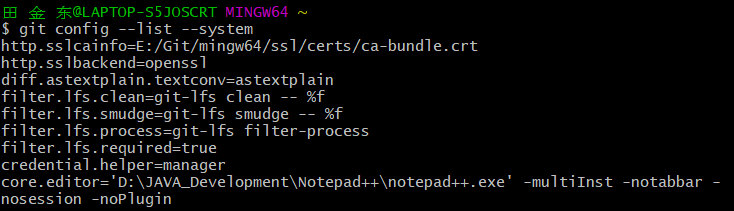
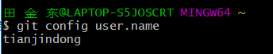

# Git的最小配置(config命令)

### 用户信息

​	当安装完 Git 应该做的第一件事就是设置你的用户名称与邮件地址。 这样做很重要，因为每一个 Git 的提交都会使用这些信息，并且它会写入到你的每一次提交中，不可更改：

#### **通过config命令设置用户信息：**

```console
$ git config --global user.name "John Doe"
$ git config --global user.email johndoe@example.com
```

​	 如果使用了 `--global` 选项，那么该命令只需要运行一次，因为之后无论你在该系统上做任何事情， Git 都会使用那些信息。 当你想针对特定项目使用不同的用户名称与邮件地址时，可以在那个项目目录下运行没有 `--global` 选项的命令来配置。

​	注意：很多 GUI 工具都会在第一次运行时帮助你配置这些信息。

#### config的三个作用域：

- `--local `    local只对某一个仓库有效

- `--global  `   global对当前用户的所有仓库有效

- `--system   `  system对系统登录的所有用户都有效

  如果设置时不指定作用域，默认就是`--local`作用域 

#### config命令的参数：	 

​	在命令行中直接输入`git config`就能看到`config`命令的所有参数了。


#### **查看设置的信息**

##### **一. 查看当前所有配置信息**

```console
#查看所有配置项
$ git config --list
```


同时还可在命令后面加上“作用域”选项：

```she
$ git config --list --local
$ git config --list --global
$ git config --list --system
```

**示例：**




##### **二. 查看某一项配置信息**

你还可以通过输入`git config <key>`来查看某一项的配置值：

```shell
#查看user.name的值
$ git config user.name
```

